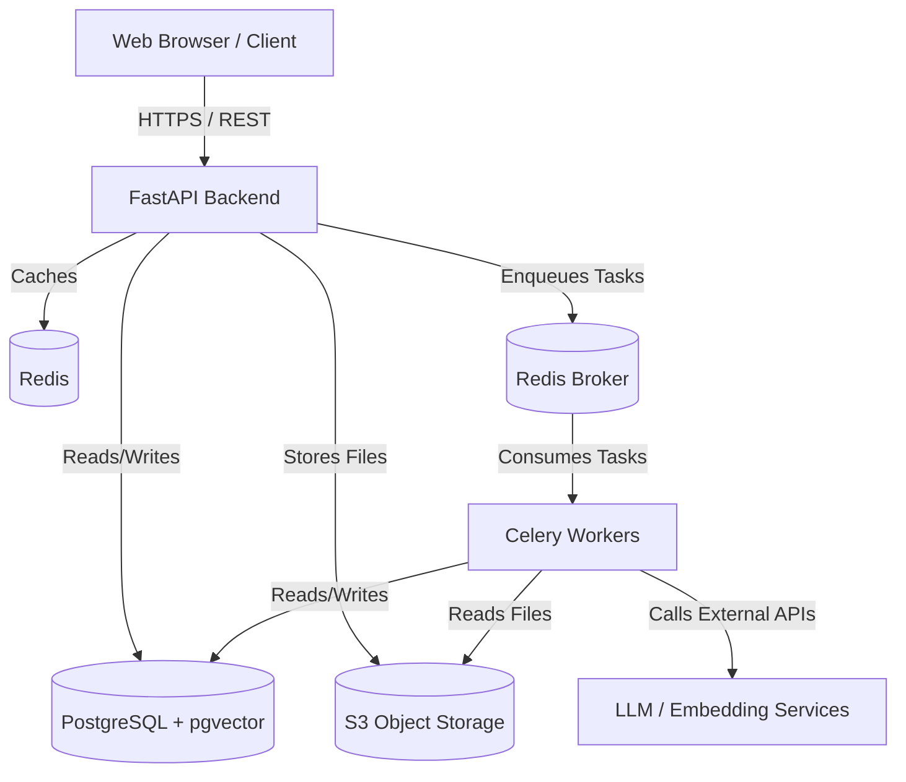

# ARCHITECTURE.md

# AI-ATS System Architecture

Version: 1.0
Status: Active

## Overview

AI-ATS follows a **Modular Monolith** architecture designed for a clear transition to microservices as the platform scales. The system leverages **Clean Architecture** and **Domain-Driven Design (DDD)** principles to separate concerns, enforce boundaries, and ensure long-term maintainability.

## High-Level Architecture

The system consists of the following primary components:

1. **Frontend (Next.js)**: A single-page application built with React, providing the user interface for recruiters, candidates, and administrators.
2. **Backend API (FastAPI)**: A modular monolith Python application exposing RESTful endpoints.
3. **Task Queue (Celery)**: Handles asynchronous background jobs (e.g., resume parsing, AI ranking, email sending).
4. **Primary Database (PostgreSQL)**: Stores relational data (users, jobs, applications) and vector embeddings (via pgvector).
5. **Cache / Message Broker (Redis)**: Caches frequent queries, manages session state, and brokers messages for Celery.
6. **Object Storage (S3-compatible)**: Stores user-uploaded files (resumes, avatars, documents).

## Clean Architecture Layers

Each domain module strictly adheres to the following layers:

1. **Presentation Layer (Controllers/Routers)**:
   - Contains FastAPI route definitions (`routers.py`).
   - Responsible for HTTP request parsing, input validation (via Pydantic), and formatting responses.
   - **Rule**: NO business logic here. Thin controllers.

2. **Application Layer (Services)**:
   - Contains business logic (`services.py`).
   - Coordinates tasks between the domain models, repositories, and external systems.
   - **Rule**: Dependencies are injected. Knows about Repositories but not database specifics.

3. **Domain Layer (Entities/Models)**:
   - Contains core business objects and rules (`models.py`, `schemas.py`).
   - **Rule**: Must not depend on any outer layers.

4. **Infrastructure Layer (Repositories/Adapters)**:
   - Contains database access logic (`repositories.py`) and external API integrations.
   - Implements interfaces defined by the Application layer.
   - **Rule**: The only layer allowed to directly execute SQL or ORM operations.

## Domain Modules

The monolith is logically divided into the following isolated modules:

- **`auth`**: Authentication, JWT generation, password hashing.
- **`organizations`**: Tenant management, billing info, org settings.
- **`users`**: User profiles, RBAC, permissions.
- **`jobs`**: Job postings, templates, required skills.
- **`candidates`**: Candidate profiles, parsed resume data, talent pool.
- **`applications`**: Job applications, pipeline stages, status tracking.
- **`ai`**: Resume parsing, embedding generation, vector search, candidate ranking.
- **`interviews`**: Interview scheduling, feedback scorecards.
- **`offers`**: Offer creation, approval workflows.
- **`notifications`**: Email sending, in-app alerts, webhooks.

### Module Interaction Rules
Modules must communicate via well-defined interfaces (Service classes). Direct cross-module database queries are forbidden.

*Correct:* `JobService` calls `CandidateService.get_candidate_by_id()`
*Incorrect:* `JobService` queries the `candidates` table directly.

## Multi-Tenancy Strategy

AI-ATS is a SaaS platform. All data is logically isolated per organization.

1. **Shared Database, Shared Schema**: All tenants share the same PostgreSQL database and tables.
2. **Tenant ID**: Every table (except platform-level tables) must have an `organization_id` foreign key.
3. **Data Access**: All repository queries MUST include a filter for `organization_id`. The tenant context is extracted from the JWT token and passed down through the service layer.

## AI Pipeline Architecture

The AI ranking and matching process is resource-intensive and must not block HTTP requests.

1. **Upload**: User uploads a resume via the API.
2. **Sync Response**: API saves the file to S3, creates a candidate record (Status: "Processing"), and returns a 202 Accepted.
3. **Async Task**: API enqueues a `parse_resume_task` in Celery.
4. **Processing**:
   - Celery worker pulls the task.
   - Extracts text from the PDF/DOCX.
   - Calls LLM to structure the data (skills, experience).
   - Generates vector embeddings for the extracted data.
   - Saves structured data and embeddings to PostgreSQL.
   - Updates candidate status to "Ready".
5. **Ranking**: When a job is viewed, the system performs a vector similarity search (pgvector) against candidate embeddings, applying business rules (SQL filters), and returning explainable scores.

## Error Handling & Logging

- **Centralized Exception Handling**: FastAPI exception handlers catch custom application exceptions and convert them into standardized JSON error responses.
- **Structured Logging**: All logs are emitted as JSON, containing `request_id`, `tenant_id`, and `user_id` for traceability.

## Scalability & Future Microservices

While starting as a monolith, the strict modular boundaries ensure that any module (e.g., the `ai` module) can be extracted into an independent microservice in the future if scaling demands require it.
