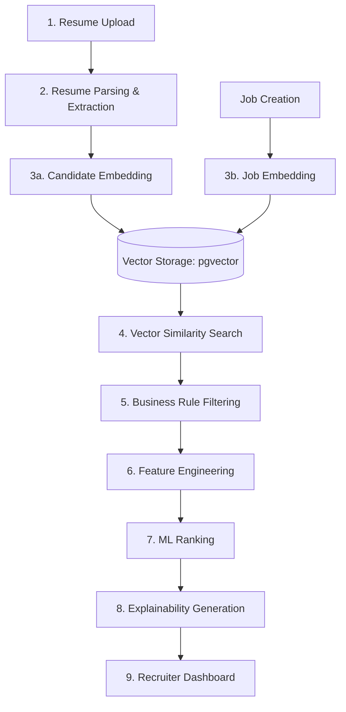

# ML_PIPELINE.md

# AI-ATS Machine Learning Pipeline

Version: 1.0
Status: Active

## Overview

The AI-ATS machine learning pipeline is designed to transform unstructured resume data and job descriptions into structured, quantifiable vectors and features, ultimately producing an explainable match score for candidates against specific jobs. 

The pipeline emphasizes **explainability**, **performance**, and **modularity** over pure black-box accuracy.

---

## 1. Pipeline Stages

The pipeline executes in the following sequence:



### 1. Resume Upload
- Candidate uploads a PDF or DOCX file.
- Handled synchronously by the API: file saved to S3, `processing` status set in DB.
- Async Celery task triggered.

### 2. Resume Parsing & Extraction
- **Input:** Raw document from S3.
- **Process:** Text extraction (PyMuPDF/pdf2image+OCR). A Large Language Model (e.g., GPT-4o-mini or Claude 3.5 Haiku) is prompted via structured output (JSON schema) to extract:
  - Work Experience (companies, titles, dates, descriptions)
  - Education (degrees, institutions, dates)
  - Skills (hard, soft, tools)
  - Contact Info
- **Output:** Structured JSON object saved to PostgreSQL (`candidates.parsed_data`).

### 3. Embedding Generation
- **Input:** Structured resume data / Job description text.
- **Process:** Text chunks are passed to an embedding model (e.g., `text-embedding-3-small` or a local `sentence-transformers` model).
- **Output:** Dense vectors (e.g., 1536 dimensions) stored in `candidates.embedding` and `jobs.embedding` using `pgvector`.

### 4. Vector Similarity Search
- **Trigger:** Recruiter views a job's application list.
- **Process:** `pgvector` performs an HNSW-indexed cosine similarity search between the job's embedding and the embeddings of all active candidates applied to that job.
- **Output:** Initial candidate pool ordered by raw semantic similarity.

### 5. Business Rule Filtering
- **Input:** Initial candidate pool.
- **Process:** Strict deterministic SQL filters are applied (e.g., must have working rights, must meet minimum years of experience). Candidates failing hard constraints are flagged or removed.
- **Output:** Filtered candidate pool.

### 6. Feature Engineering
- **Input:** Candidate parsed data + Job requirements.
- **Process:** Calculating explicit tabular features:
  - `skills_overlap_ratio`: % of required job skills present in the resume.
  - `experience_delta`: Candidate total years exp minus Job required years exp.
  - `semantic_similarity_score`: The raw cosine similarity score from Step 4.
  - `education_match`: Boolean or tiered match (e.g., Job requires BS, Candidate has MS).
- **Output:** A feature vector (tabular data row) for each candidate-job pair.

### 7. ML Ranking (The Ranker)
- **Input:** Feature vectors.
- **Process:** A lightweight tabular ML model (e.g., XGBoost, LightGBM, or Logistic Regression) predicts the likelihood of the candidate being a "good fit" or moving to the next stage.
- **Why Tabular?** We use XGBoost/LightGBM instead of an LLM for ranking because it is vastly cheaper, faster (milliseconds), and highly explainable (SHAP values).
- **Output:** A normalized match score (0-100) for the application.

### 8. Explainability Generation
- **Input:** ML Ranker outputs, SHAP values, and the original extracted features.
- **Process:** The system generates human-readable reasons for the score. (e.g., "High match due to 90% skill overlap, including required skills Python and React. However, total experience is 2 years short of the requested 5 years.")
- **Output:** Explainability payload (Strengths, Weaknesses, Match Score, Confidence).

---

## 2. Model Management

The system defines interfaces for models, ensuring they can be swapped out without rewriting core logic.

```python
class BaseRanker(ABC):
    @abstractmethod
    def predict(self, features: pd.DataFrame) -> np.ndarray:
        pass
        
    @abstractmethod
    def explain(self, features: pd.DataFrame) -> dict:
        pass
```

## 3. Cost Optimization Strategies

1. **Batching:** Send embedding requests in batches to the provider to maximize throughput and minimize latency.
2. **Caching:** Cache the vector search results in Redis for 15 minutes when a recruiter views a job, to prevent recalculating embeddings on every page load.
3. **LLM Tiering:** Use cheaper models (e.g., Haiku/GPT-4o-mini) for structured extraction, and reserve complex models only if human-in-the-loop overrides require deep reasoning.
4. **Async First:** All AI processing happens in Celery workers, never blocking the web server.
