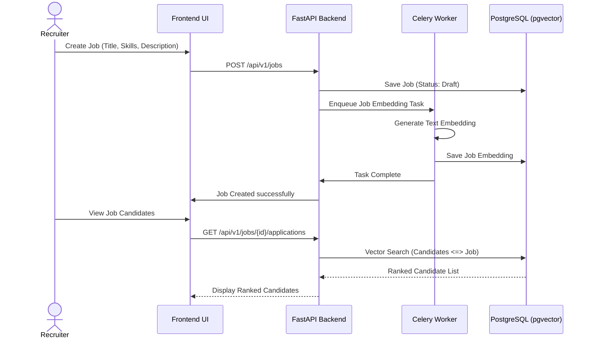
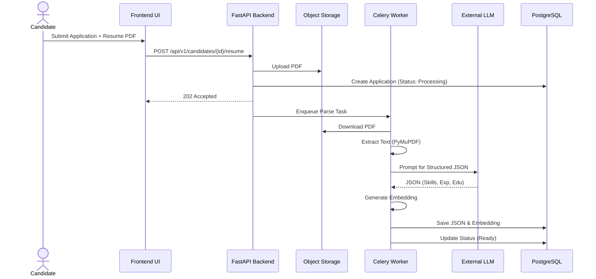
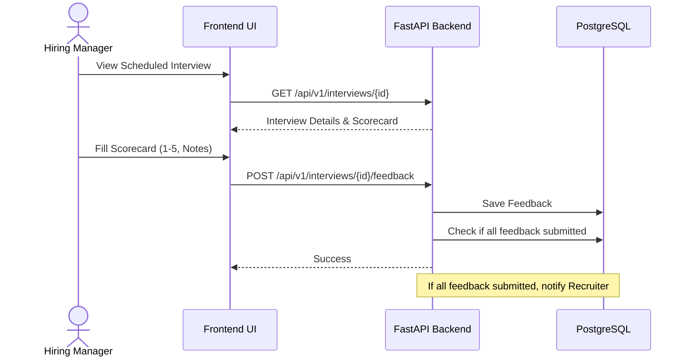

# USER_FLOWS.md

# AI-ATS User Flows

## 1. Recruiter: Job Creation & Candidate Matching

```mermaid
sequenceDiagram
    actor Recruiter
    participant Web as Frontend UI
    participant API as FastAPI Backend
    participant Worker as Celery Worker
    participant DB as PostgreSQL (pgvector)
    
    Recruiter->>Web: Create Job (Title, Skills, Description)
    Web->>API: POST /api/v1/jobs
    API->>DB: Save Job (Status: Draft)
    API->>Worker: Enqueue Job Embedding Task
    Worker->>Worker: Generate Text Embedding
    Worker->>DB: Save Job Embedding
    Worker->>API: Task Complete
    API->>Web: Job Created successfully
    
    Recruiter->>Web: View Job Candidates
    Web->>API: GET /api/v1/jobs/{id}/applications
    API->>DB: Vector Search (Candidates <=> Job)
    DB-->>API: Ranked Candidate List
    API-->>Web: Display Ranked Candidates
```

## 2. Candidate: Application Process

```mermaid
sequenceDiagram
    actor Candidate
    participant Web as Frontend UI
    participant API as FastAPI Backend
    participant S3 as Object Storage
    participant Worker as Celery Worker
    participant LLM as External LLM
    participant DB as PostgreSQL
    
    Candidate->>Web: Submit Application + Resume PDF
    Web->>API: POST /api/v1/candidates/{id}/resume
    API->>S3: Upload PDF
    API->>DB: Create Application (Status: Processing)
    API-->>Web: 202 Accepted
    
    API->>Worker: Enqueue Parse Task
    Worker->>S3: Download PDF
    Worker->>Worker: Extract Text (PyMuPDF)
    Worker->>LLM: Prompt for Structured JSON
    LLM-->>Worker: JSON (Skills, Exp, Edu)
    Worker->>Worker: Generate Embedding
    Worker->>DB: Save JSON & Embedding
    Worker->>DB: Update Status (Ready)
```

## 3. Hiring Manager: Interview Feedback

```mermaid
sequenceDiagram
    actor Manager as Hiring Manager
    participant Web as Frontend UI
    participant API as FastAPI Backend
    participant DB as PostgreSQL
    
    Manager->>Web: View Scheduled Interview
    Web->>API: GET /api/v1/interviews/{id}
    API-->>Web: Interview Details & Scorecard
    
    Manager->>Web: Fill Scorecard (1-5, Notes)
    Web->>API: POST /api/v1/interviews/{id}/feedback
    API->>DB: Save Feedback
    API->>DB: Check if all feedback submitted
    API-->>Web: Success
    
    Note over API,DB: If all feedback submitted, notify Recruiter
```
